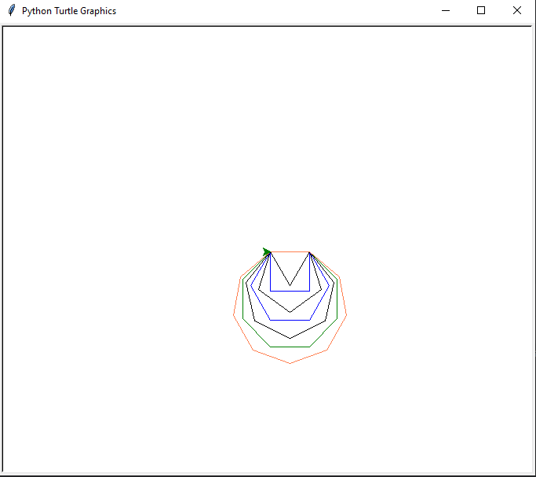
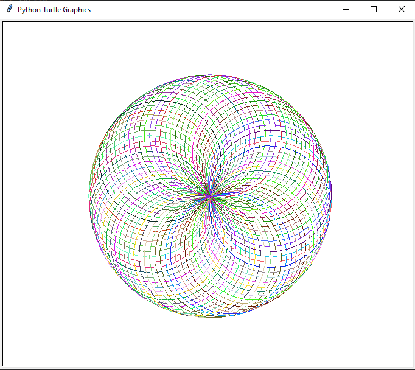
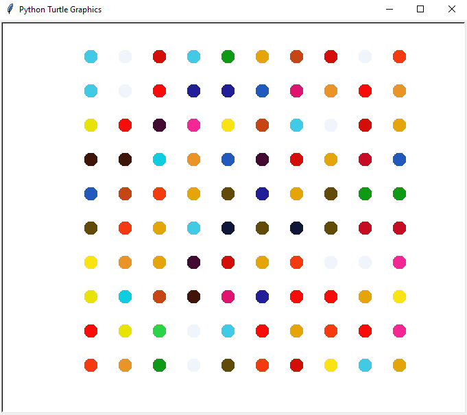

# Basic Python Projects

The **Basic_Python_Projects** repository showcases a collection of personal projects I’ve created as part of my journey to learn Python programming. This collection features various applications and games, including a Snake Game, Turtle Race, Arcade Game, Quiz Application and many more, each reflecting different programming concepts I’ve explored.

Through these projects, I’ve gained hands-on experience with:

- Game development principles
- Graphics and user interface design
- Control flow
- Problem-solving and coding logic

This repository is a personal reflection of my progress in learning Python and serves as a milestone in my coding journey. I hope to continue expanding this collection as I learn new skills and take on more complex challenges.

## Projects

### [Locate-US-States Game](https://github.com/MansiRaghav/Basic_Python_Projects/tree/c279bf40935e481ac3d1589ff3462d59bfb7b212/Locate-US-States-game)

The U.S. States Game is an interactive quiz that challenges players to name all 50 U.S. states on a blank map. Players input guesses, and the program tracks correct answers, displaying the names of guessed states on the map.Using Turtle graphics for visualization, I learned to integrate user input and manage game state while utilizing the Pandas library to handle data, including reading and writing CSV files. 

### [NATO Alphabet Project](https://github.com/MansiRaghav/Basic_Python_Projects/tree/542fb39eb3fe7bcb6219eff9f6e9acc07af6faf5/NATOAlbhabetProject)

The NATO Alphabet Project converts words into their corresponding phonetic alphabet representations using the NATO phonetic alphabet. The program reads data from a CSV file containing letters and their phonetic codes, creates a dictionary for quick lookup, and prompts users to input a word. It then outputs a list of the phonetic representations of each letter in the word. Through this project, I learned about data handling with pandas, dictionary comprehensions, and user input processing in Python.

### [OOP Coffee Machine](https://github.com/MansiRaghav/Basic_Python_Projects/tree/542fb39eb3fe7bcb6219eff9f6e9acc07af6faf5/OOP-Coffee-Machine)

The OOP Coffee Machine is an interactive program that allows users to order coffee from a menu while managing resources and payments. Users can choose from various coffee options, check reports on resources and earnings, and handle payment transactions. Throughout this project, I implemented object-oriented programming principles by utilizing classes for the menu, coffee maker, and money machine, which improved my understanding of modular code design and resource management.

### [Pomodoro Focus Timer](https://github.com/MansiRaghav/Basic_Python_Projects/tree/542fb39eb3fe7bcb6219eff9f6e9acc07af6faf5/Pomodoro%20Focus)

The Pomodoro Focus Timer is a productivity tool built using Tkinter that helps users manage their work sessions and breaks based on the Pomodoro Technique. Users can start a timer for focused work sessions (45 minutes), followed by short breaks (5 minutes) and long breaks (20 minutes). The application visually displays the countdown and tracks completed sessions with check marks. Through this project, I gained hands-on experience with GUI development in Python, learned how to handle user interactions, and implemented a countdown mechanism using mathematical calculations.

### [Snake Game Project](https://github.com/MansiRaghav/Basic_Python_Projects/tree/542fb39eb3fe7bcb6219eff9f6e9acc07af6faf5/SnakeGameProject)

The Snake Game is a classic arcade-style game built using Python's Turtle graphics library. Players control a snake that grows longer as it consumes food while navigating within a bounded area. The game includes collision detection with walls and the snake's own tail, resulting in a game reset upon collision. Throughout this project, I learned about object-oriented programming by creating separate classes for the snake, food, and scoreboard. I gained experience in handling user input, managing game states, and implementing collision detection, which improved my skills in game development and programming logic.

### [The Quiz Game](https://github.com/MansiRaghav/Basic_Python_Projects/tree/542fb39eb3fe7bcb6219eff9f6e9acc07af6faf5/The-Quiz-Game)

The Quiz Game is an interactive trivia game where players answer questions from a predefined set of data. Each question is presented to the player in sequence, and their score is tallied as they progress through the quiz. This project utilizes object-oriented programming principles by creating separate classes for question handling and quiz logic. Throughout this project, I learned how to manage question data effectively, implement a scoring system, and enhance user engagement through dynamic input handling. 

### [The Arcade Game](https://github.com/MansiRaghav/Basic_Python_Projects/tree/542fb39eb3fe7bcb6219eff9f6e9acc07af6faf5/TheArcadeGame)

The Arcade Game is a classic Pong-style game built using Python's Turtle graphics library. Players control two paddles on either side of the screen to bounce a ball back and forth. The game tracks scores and detects collisions with walls and paddles, updating the score when a player misses the ball. This project allowed me to apply object-oriented programming by creating separate classes for paddles, the ball, and the scoreboard. I gained hands-on experience in handling user input, implementing collision detection, and managing game state through a continuous update loop.

### [Turtle Graphics Project (Pattern and Spirograph)](https://github.com/MansiRaghav/Basic_Python_Projects/tree/542fb39eb3fe7bcb6219eff9f6e9acc07af6faf5/Turtle%20Graphics)

The Turtle Graphics Pattern project defines a function to draw shapes with a variable number of sides and randomly selects colors from a predefined list for each shape. By looping through a range of sides from 3 to 10, the project generates colorful geometric patterns. Through this project, I learned about using functions, loops, and randomization in Turtle graphics to create visually appealing designs.

The Spirograph project creates intricate circular patterns using Python's Turtle graphics library. The program defines a function to generate colorful circles while rotating the turtle's heading by a specified angle (size of the gap) after each circle is drawn. It utilizes a function to generate random RGB colors for each circle, resulting in vibrant and dynamic designs. Through this project, I learned about the principles of drawing with Turtle graphics, color generation, and controlling the turtle's movement for artistic effects.

### [Turtle Road Crossing Game](https://github.com/MansiRaghav/Basic_Python_Projects/tree/542fb39eb3fe7bcb6219eff9f6e9acc07af6faf5/Turtle_Road_Crossing_Game)

The Turtle Road Crossing Game is an interactive game where players control a turtle that must cross a busy road filled with moving cars. Players move the turtle upward using the "Up" arrow key while avoiding collisions with cars. The game tracks the player's level, and successfully crossing the road resets the turtle to the starting position and increases the difficulty. Through this project, I learned about object-oriented programming by creating classes for the player, car manager, and scoreboard. I gained experience in collision detection, handling user input, and managing game states, which enhanced my skills in game development and programming logic.

### [Hirst Painting](https://github.com/MansiRaghav/Basic_Python_Projects/blob/542fb39eb3fe7bcb6219eff9f6e9acc07af6faf5/Hirst_Painting.py)

The Hirst Painting project creates a digital artwork inspired by the dot paintings of Damien Hirst using Python's Turtle graphics library. The program generates a grid of colorful dots, randomly selecting colors from a predefined list to create a vibrant and visually appealing pattern. Through this project, I learned about using the Turtle graphics library for drawing, manipulating coordinates, and working with randomization to achieve artistic effects.

### [Miles to Kilometer Converter](https://github.com/MansiRaghav/Basic_Python_Projects/blob/542fb39eb3fe7bcb6219eff9f6e9acc07af6faf5/Mile_To_Kilometer_Convertor.py)

The Miles to Kilometer Converter is a simple graphical user interface (GUI) application created using Python's Tkinter library. Users can input a distance in miles, and upon clicking the "Calculate" button, the application converts the input into kilometers and displays the result. The application rounds the result to the nearest whole number for simplicity. Through this project, I gained experience in building GUIs with Tkinter, handling user input, and implementing basic mathematical conversions.

### [Turtle Random Move](https://github.com/MansiRaghav/Basic_Python_Projects/blob/542fb39eb3fe7bcb6219eff9f6e9acc07af6faf5/Turtle-_Random_Move.py)

The Turtle Random Move project creates a colorful, abstract design using Python's Turtle graphics library. The turtle moves in random directions while changing colors, resulting in a vibrant pattern. The program utilizes randomization to select movement angles and colors, producing unique visual outputs each time it runs. Through this project, I learned about using the Turtle graphics library for creative coding, implementing functions to generate random colors, and applying control structures for movement. 

### [Turtle Race](https://github.com/MansiRaghav/Basic_Python_Projects/blob/542fb39eb3fe7bcb6219eff9f6e9acc07af6faf5/Turtle_Race.py)

The Turtle Race project is an interactive game where users can place bets on their favorite turtle to win a race. The program sets up a race track using Python's Turtle graphics library, creating five turtles of different colors that race across the screen. Users input their chosen turtle's color, and the race progresses with each turtle moving randomly. Once a turtle crosses the finish line, the program announces the winner and whether the user won their bet. Through this project, I learned about event-driven programming, managing user input, and utilizing loops and conditionals in a game setting. 

## Techstack

- Python

## Libraries 

### Graphical and GUI Libraries:

- Turtle
- Tkinter

### Data Handling:
- Pandas

### Randomization:
- Random

### Math and Utility:
- Math

Screenshots/MileConverterSS.png

